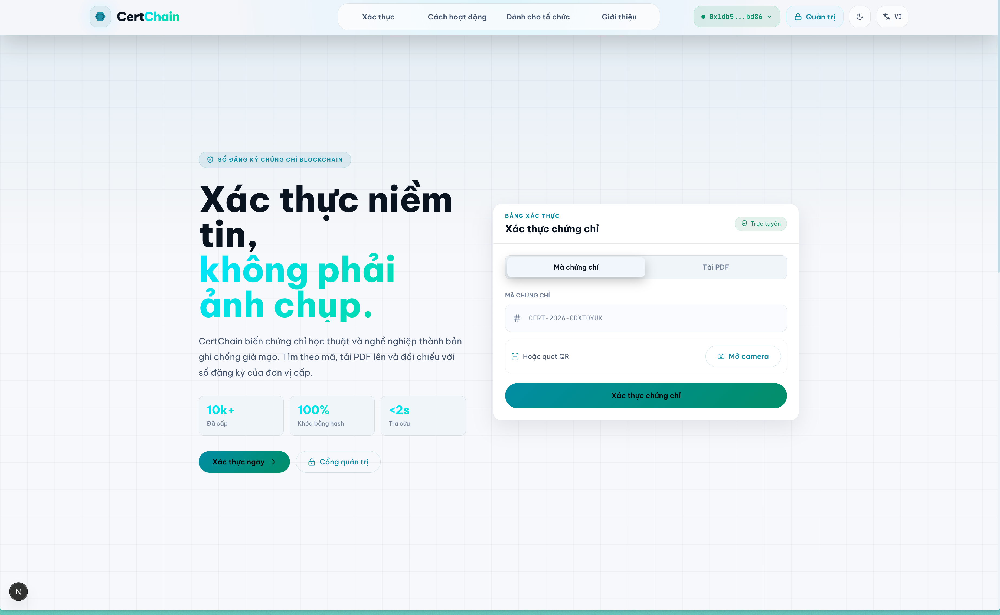
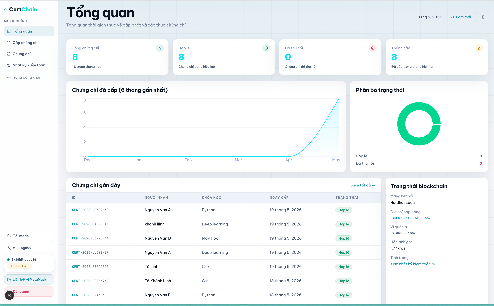
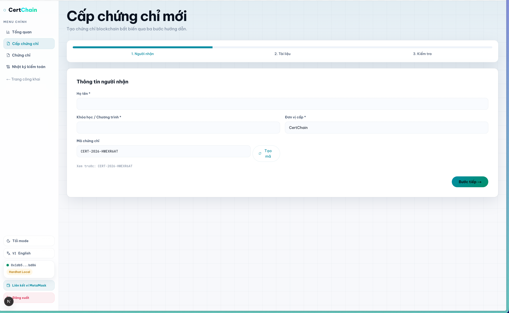
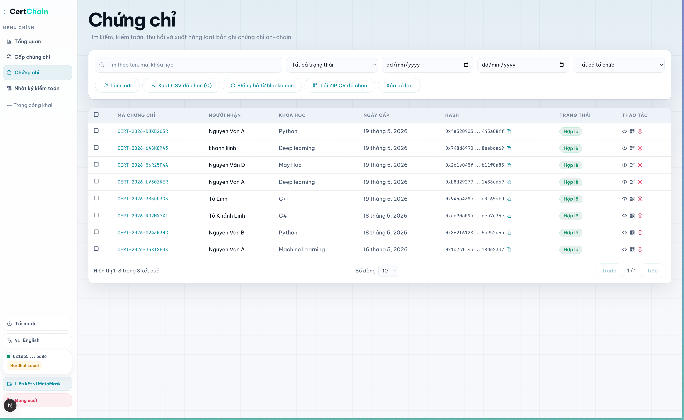
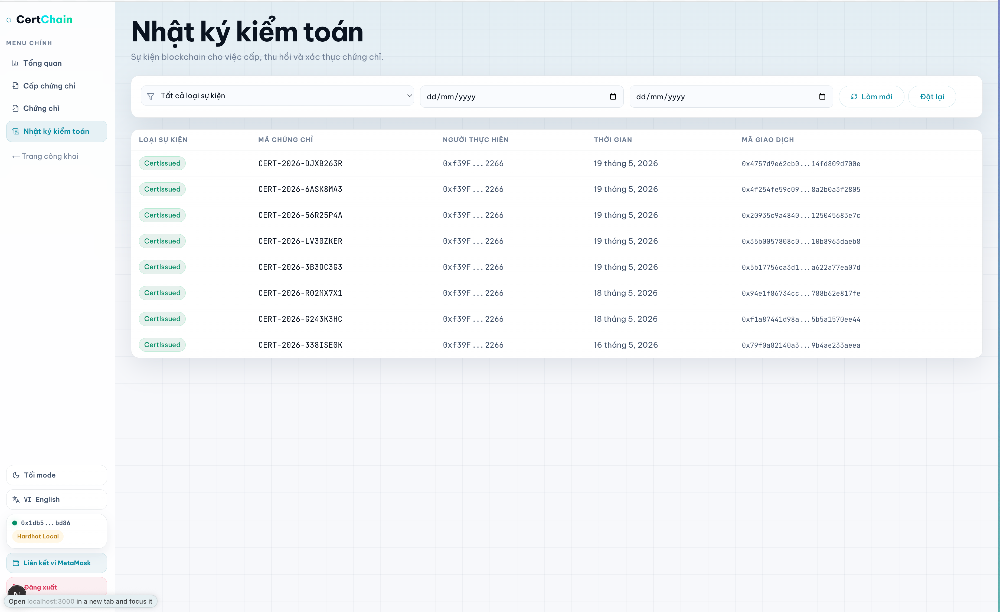
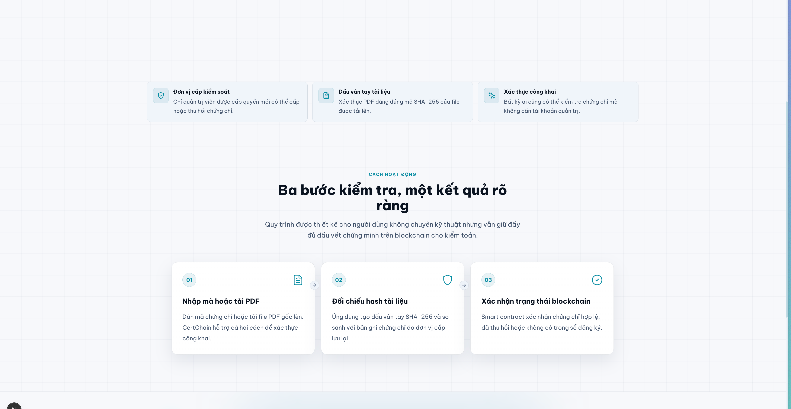
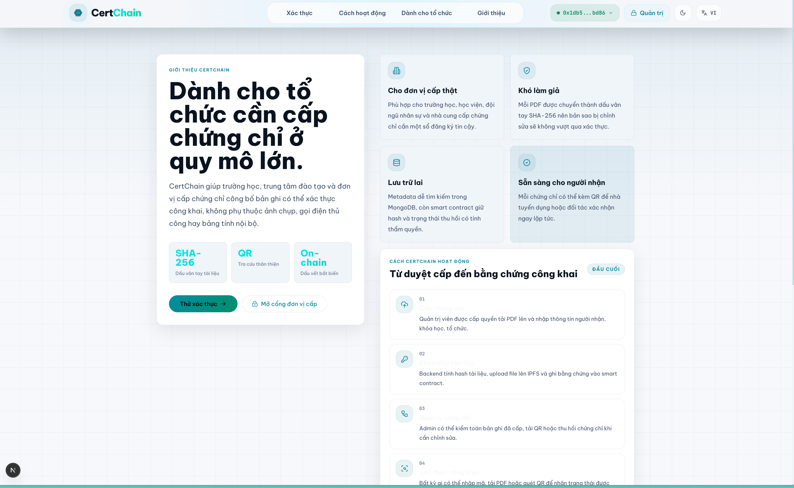

# CertChain

CertChain là hệ thống cấp, quản trị và xác thực chứng chỉ bằng blockchain. Dữ liệu xác thực cuối cùng nằm trên smart contract, còn MongoDB dùng để phục vụ dashboard, tìm kiếm, QR và nghiệp vụ quản trị.








## Thành Phần Chính

- `smart-contract`: Hardhat + Solidity, contract `CertRegistry.sol` lưu chứng chỉ on-chain.
- `backend`: Node.js + Express + MongoDB + ethers.js, xử lý admin API, IPFS, QR, JWT, đồng bộ dữ liệu và giao dịch ghi blockchain.
- `frontend`: Next.js + TypeScript, gồm trang xác thực công khai và dashboard quản trị.

## Luồng Hoạt Động

### 1. Cấp Chứng Chỉ

```txt
Admin đăng nhập
→ Nhập thông tin chứng chỉ
→ Upload PDF
→ Backend-signed mode: backend hash PDF, upload IPFS và gửi issueCertificate()
→ MetaMask mode: frontend hash PDF, backend chỉ upload IPFS, MetaMask gửi issueCertificate()
→ MongoDB lưu metadata để dashboard tra cứu nhanh
→ Backend tạo QR trỏ tới /verify/{certId}
```

Dữ liệu quan trọng được ghi on-chain:

- `certHash`
- `certId`
- `ipfsCID`
- `recipientName`
- `courseName`
- `issuingOrg`
- `issuer`
- `issuedAt`
- `isRevoked`

### 2. Xác Thực Chứng Chỉ

Luồng xác thực công khai hiện tại đọc trực tiếp từ blockchain:

```txt
User nhập Cert ID hoặc upload PDF
→ Frontend dùng ethers.js gọi smart contract trực tiếp
→ Không cần backend cho bước verify
→ Hiển thị Valid / Revoked / Not Found
```

Nếu xác thực bằng PDF:

```txt
Frontend tính SHA-256 bằng Web Crypto API
→ Convert thành bytes32
→ Gọi getCertificate(hash) trên smart contract
```

Nếu xác thực bằng mã chứng chỉ:

```txt
Frontend gọi getCertificateById(certId) trên smart contract
```

### 3. QR Code

```txt
QR chứa URL /verify/{certId}
→ Người dùng quét QR
→ Browser mở trang verify
→ Frontend đọc smart contract trực tiếp
→ Hiển thị kết quả xác thực
```

### 4. Thu Hồi Chứng Chỉ

```txt
Admin chọn chứng chỉ
→ Nhập lý do thu hồi
→ Backend gọi revokeCertificate()
→ Blockchain cập nhật isRevoked = true
→ MongoDB cập nhật trạng thái
→ Verify lại sẽ hiển thị Certificate Revoked
```

## Chạy Nhanh Bằng Docker Dev

Đây là cách chạy khuyến nghị. Docker tự chạy đủ service cần thiết:

- MongoDB
- Hardhat local blockchain
- Deploy/reuse smart contract local
- Backend API
- Frontend Next.js

### Yêu Cầu

- Docker Desktop hoặc Docker Engine đang chạy.
- Node.js 20+ nếu muốn chạy test/lint/build ngoài Docker.
- MetaMask nếu muốn test đăng nhập ví hoặc ký giao dịch bằng ví.

Kiểm tra Docker:

```bash
docker --version
docker compose version
```

### Khởi Chạy Toàn Bộ Project

Chạy local Hardhat:

```bash
cd /Users/tolinh/Documents/Programming/blockchain/certchain
./scripts/dev-docker.sh
```

Chạy Sepolia testnet bằng cùng entrypoint Docker:

```bash
cd /Users/tolinh/Documents/Programming/blockchain/certchain
./scripts/dev-docker.sh sepolia
```

Script sẽ tự lấy IP LAN của máy và in ra dạng:

```txt
CertChain Docker dev stack
- Frontend: http://192.168.x.x:3000
- Backend:  http://192.168.x.x:5001/api
- Hardhat:  http://192.168.x.x:8545
```

Mở trên máy Mac:

```txt
http://localhost:3000
```

Mở trên điện thoại cùng Wi-Fi:

```txt
http://192.168.x.x:3000
```

Không dùng `localhost` trên điện thoại, vì `localhost` lúc đó là chính điện thoại chứ không phải máy Mac.

### Kiểm Tra Service

```bash
docker compose -f docker-compose.dev.yml ps
```

Kết quả đúng: `mongodb`, `hardhat`, `backend`, `frontend` đều `Up`; `hardhat` và `mongodb` nên có trạng thái `healthy`.

Health backend:

```bash
curl -s http://localhost:5001/health
```

Health Hardhat RPC:

```bash
curl -s -X POST http://localhost:8545 \
  -H 'content-type: application/json' \
  --data '{"jsonrpc":"2.0","id":1,"method":"eth_chainId","params":[]}'
```

Hardhat local trả chain id:

```json
{ "jsonrpc": "2.0", "id": 1, "result": "0x7a69" }
```

### Seed Tài Khoản Admin

Sau khi backend chạy xong:

```bash
curl -X POST http://localhost:5001/api/auth/seed
```

Tài khoản mặc định:

```txt
Username: admin
Password: Admin@123456
```

### Dừng Docker

Dừng service nhưng giữ database dev:

```bash
docker compose -f docker-compose.dev.yml down
```

Dừng và xóa sạch database dev:

```bash
docker compose -f docker-compose.dev.yml down -v
```

Chạy lại sau khi tắt máy:

```bash
cd /Users/tolinh/Documents/Programming/blockchain/certchain
./scripts/dev-docker.sh
```

## Docker Dev Tự Động Làm Gì?

`scripts/dev-docker.sh` tự động:

- Detect IP LAN của máy Mac.
- Set `FRONTEND_URL`, `PUBLIC_FRONTEND_URL`, `NEXT_PUBLIC_FRONTEND_URL`, `NEXT_PUBLIC_API_URL`, `NEXT_PUBLIC_RPC_URL`, `CORS_ALLOWED_ORIGINS`.
- QR xác thực dùng `PUBLIC_FRONTEND_URL`/`NEXT_PUBLIC_FRONTEND_URL`; khi quét bằng điện thoại, giá trị này phải là IP LAN hoặc domain thật, không phải `localhost`.
- Start MongoDB container.
- Start Hardhat local node.
- Chạy deploy contract local.
- Reuse contract local nếu `0x5FbDB2315678afecb367f032d93F642f64180aa3` đã tồn tại, tránh lệch address.
- Start backend và frontend.

Vì vậy khi chạy Docker dev:

- Không cần chạy MongoDB local.
- Không cần chạy `npx hardhat node` thủ công.
- Không cần deploy contract thủ công.
- Không cần sửa `MONGODB_URI` trong `backend/.env` sang Docker host.

## Chạy Bằng Docker Nhưng Lưu Trên Sepolia Testnet

Chế độ này dùng MongoDB/backend/frontend trong Docker, nhưng giao dịch `issueCertificate()` được ghi lên Ethereum Sepolia thật qua Alchemy RPC. Không chạy Hardhat local.

Điểm khác nhau:

- `./scripts/dev-docker.sh` hoặc `./scripts/dev-docker.sh local`: lưu on-chain vào Hardhat local `31337`.
- `./scripts/dev-docker.sh sepolia`: lưu on-chain vào Sepolia testnet `11155111`.
- `./scripts/dev-sepolia.sh` vẫn tồn tại như alias nội bộ cho chế độ Sepolia.

### 1. Chuẩn Bị Sepolia

Cần có:

- Alchemy Sepolia RPC URL.
- Ví deploy/backend có Sepolia ETH testnet.
- `PRIVATE_KEY` của ví deploy trong `smart-contract/.env`.
- `ADMIN_PRIVATE_KEY` trong `backend/.env`. Ví này phải là admin của contract. Nếu dùng cùng ví deploy thì deployer mặc định đã là admin.
- Không dùng private key Hardhat local `0xac0974...f80` cho Sepolia. Key đó map tới `0xf39F...2266` và không có quyền trên contract Sepolia.

Ví dụ `smart-contract/.env`:

```env
PRIVATE_KEY=0x_your_deployer_private_key
ALCHEMY_SEPOLIA_URL=https://eth-sepolia.g.alchemy.com/v2/YOUR_KEY
ETHERSCAN_API_KEY=your_etherscan_key_optional
```

Ví dụ `backend/.env`:

```env
PORT=5001
MONGODB_URI=mongodb://127.0.0.1:27017/certchain
JWT_SECRET=change_me
JWT_REFRESH_SECRET=change_me_refresh
PINATA_API_KEY=your_pinata_key
PINATA_SECRET_KEY=your_pinata_secret
PINATA_GATEWAY=https://gateway.pinata.cloud/ipfs
ALCHEMY_URL=https://eth-sepolia.g.alchemy.com/v2/YOUR_KEY
ADMIN_PRIVATE_KEY=0x_your_backend_or_deployer_private_key
CONTRACT_ADDRESS=0x_fill_after_deploy
FRONTEND_URL=http://localhost:3000
PUBLIC_FRONTEND_URL=http://localhost:3000
NEXT_PUBLIC_FRONTEND_URL=http://localhost:3000
BASE_URL=http://localhost:3000
DEFAULT_ADMIN_USERNAME=admin
DEFAULT_ADMIN_PASSWORD=Admin@123456
```

Không commit private key thật.

### 2. Deploy Contract Lên Sepolia

```bash
cd /Users/tolinh/Documents/Programming/blockchain/certchain/smart-contract
npm ci
npm run deploy:sepolia
```

Sau khi deploy, copy dòng:

```txt
Contract address: 0x...
```

dán vào:

`backend/.env`:

```env
CONTRACT_ADDRESS=0x_your_sepolia_contract_address
ALCHEMY_URL=https://eth-sepolia.g.alchemy.com/v2/YOUR_KEY
```

`frontend/.env.local`:

```env
NEXT_PUBLIC_CONTRACT_ADDRESS=0x_your_sepolia_contract_address
NEXT_PUBLIC_CHAIN_ID=11155111
NEXT_PUBLIC_RPC_URL=https://eth-sepolia.g.alchemy.com/v2/YOUR_KEY
NEXT_PUBLIC_SEPOLIA_RPC_URL=https://eth-sepolia.g.alchemy.com/v2/YOUR_KEY
NEXT_PUBLIC_ALCHEMY_KEY=YOUR_KEY
```

### 3. Chạy Docker Sepolia

Nếu đang chạy stack Hardhat local thì dừng trước:

```bash
docker compose -f docker-compose.dev.yml down
```

Chạy Sepolia:

```bash
cd /Users/tolinh/Documents/Programming/blockchain/certchain
./scripts/dev-docker.sh sepolia
```

Script sẽ in:

```txt
CertChain Sepolia Docker stack
- Frontend: http://...
- Backend:  http://.../api
- RPC:      https://eth-sepolia.g.alchemy.com/v2/...
- Chain:    Sepolia (11155111)
- Contract: 0x...
```

Seed admin:

```bash
curl -X POST http://localhost:5001/api/auth/seed
```

### 4. Kiểm Tra Giao Dịch Trên Sepolia

Sau khi cấp chứng chỉ thành công, giao diện sẽ hiển thị:

- `Mã giao dịch`
- `Số block`
- `Ví cấp chứng chỉ`

Mở transaction trên Sepolia Etherscan:

```txt
https://sepolia.etherscan.io/tx/YOUR_TX_HASH
```

Mở contract trên Sepolia Etherscan:

```txt
https://sepolia.etherscan.io/address/YOUR_CONTRACT_ADDRESS
```

Chế độ `Cấp qua MetaMask` gọi `issueCertificate()` trực tiếp bằng signer của ví đang kết nối. Trên Sepolia Etherscan, trường `From` phải đúng ví MetaMask đó. Sau khi receipt thành công, frontend gọi backend sync để lưu MongoDB và tạo QR cho dashboard.

Chế độ `Cấp qua backend` vẫn dùng `ADMIN_PRIVATE_KEY` của backend để gửi transaction. Dùng mode này khi cần ví server cấp chứng chỉ thay cho browser wallet.

## Biến Môi Trường

Không commit file `.env`, `.env.local` hoặc private key thật.

### Backend `backend/.env`

Docker dev override các biến kết nối nội bộ sau:

```env
MONGODB_URI=mongodb://mongodb:27017/certchain
ALCHEMY_URL=http://hardhat:8545
CONTRACT_ADDRESS=0x5FbDB2315678afecb367f032d93F642f64180aa3
```

Các biến vẫn nên có trong `backend/.env`:

```env
PORT=5001
NODE_ENV=development

JWT_SECRET=change_me_local
JWT_EXPIRES_IN=8h
JWT_REFRESH_SECRET=change_me_refresh_local
JWT_REFRESH_EXPIRES_IN=7d

PINATA_API_KEY=your_pinata_key
PINATA_SECRET_KEY=your_pinata_secret
PINATA_GATEWAY=https://gateway.pinata.cloud/ipfs

ADMIN_PRIVATE_KEY=local_hardhat_account_private_key

FRONTEND_URL=http://localhost:3000
CORS_ALLOWED_ORIGINS=http://localhost:3000,http://127.0.0.1:3000
BASE_URL=http://localhost:5001

DEFAULT_ADMIN_USERNAME=admin
DEFAULT_ADMIN_PASSWORD=Admin@123456

CONTRACT_DEPLOY_BLOCK=0
AUDIT_LOOKBACK_BLOCKS=1000
AUDIT_LOG_BLOCK_WINDOW=10
AUDIT_SCAN_FROM_DEPLOY=false
AUDIT_ENABLE_CHAIN_EVENTS=false
```

`ADMIN_PRIVATE_KEY` chỉ dùng private key local của Hardhat account khi dev. Không dùng ví thật.
`AUDIT_ENABLE_CHAIN_EVENTS=false` giúp trang nhật ký kiểm toán mượt hơn trên Sepolia free-tier; dữ liệu cấp/thu hồi vẫn lấy ổn định từ MongoDB. Chỉ bật `true` khi cần làm giàu nhật ký bằng log blockchain trực tiếp.

### Frontend `frontend/.env.local`

Máy Mac local:

```env
NEXT_PUBLIC_API_URL=http://localhost:5001/api
NEXT_PUBLIC_CONTRACT_ADDRESS=0x5FbDB2315678afecb367f032d93F642f64180aa3
NEXT_PUBLIC_CHAIN_ID=31337
NEXT_PUBLIC_RPC_URL=http://localhost:8545
NEXT_PUBLIC_ALCHEMY_KEY=
NEXT_PUBLIC_IPFS_GATEWAY=https://gateway.pinata.cloud/ipfs
NEXT_PUBLIC_ISSUING_ORG=CertChain
```

Điện thoại cùng Wi-Fi:

```env
NEXT_PUBLIC_API_URL=http://YOUR_MAC_IP:5001/api
NEXT_PUBLIC_CONTRACT_ADDRESS=0x5FbDB2315678afecb367f032d93F642f64180aa3
NEXT_PUBLIC_CHAIN_ID=31337
NEXT_PUBLIC_RPC_URL=http://YOUR_MAC_IP:8545
NEXT_PUBLIC_ALCHEMY_KEY=
NEXT_PUBLIC_IPFS_GATEWAY=https://gateway.pinata.cloud/ipfs
NEXT_PUBLIC_ISSUING_ORG=CertChain
```

Lấy IP LAN:

```bash
ipconfig getifaddr en0
```

Khi chạy bằng `./scripts/dev-docker.sh`, script đã tự inject IP LAN vào Docker container.

## Chạy Thủ Công Không Dùng Docker

Chỉ dùng khi cần debug từng service riêng.

### Terminal 1: MongoDB

```bash
brew services start mongodb-community
mongosh --quiet --eval "db.adminCommand({ ping: 1 })" mongodb://127.0.0.1:27017/certchain
```

### Terminal 2: Hardhat

```bash
cd smart-contract
npx hardhat node
```

### Terminal 3: Deploy Contract

```bash
cd smart-contract
npx hardhat run scripts/deploy.js --network localhost
```

Copy contract address vào:

`backend/.env`:

```env
ALCHEMY_URL=http://127.0.0.1:8545
CONTRACT_ADDRESS=0x5FbDB2315678afecb367f032d93F642f64180aa3
ADMIN_PRIVATE_KEY=local_hardhat_account_private_key
```

`frontend/.env.local`:

```env
NEXT_PUBLIC_CONTRACT_ADDRESS=0x5FbDB2315678afecb367f032d93F642f64180aa3
NEXT_PUBLIC_CHAIN_ID=31337
NEXT_PUBLIC_RPC_URL=http://localhost:8545
```

### Terminal 4: Backend

```bash
cd backend
npm ci
npm run dev
```

Seed admin:

```bash
curl -X POST http://localhost:5001/api/auth/seed
```

### Terminal 5: Frontend

```bash
cd frontend
npm ci
npm run dev
```

## API Chính

Base URL dev:

```txt
http://localhost:5001/api
```

Auth:

```txt
POST /auth/seed
POST /auth/login
POST /auth/login-metamask
POST /auth/link-wallet
POST /auth/logout
GET  /auth/me
```

Certificates admin, yêu cầu JWT:

```txt
POST /certificates/issue
POST /certificates/sync-from-chain
GET  /certificates
GET  /certificates/stats
GET  /certificates/audit
GET  /certificates/:certId
GET  /certificates/:certId/qr
PUT  /certificates/:certHash/revoke
```

Verify public API vẫn tồn tại để tương thích và lịch sử, nhưng giao diện xác thực chính đọc blockchain trực tiếp:

```txt
POST /verify/by-id
POST /verify/by-file
POST /verify/by-hash
GET  /verify/:certId/history
```

Health:

```txt
GET /health
GET /api/health
```

## Kiểm Tra Code

Smart contract:

```bash
cd smart-contract
npx hardhat compile
npx hardhat test
```

Backend:

```bash
cd backend
npm test
```

Frontend:

```bash
cd frontend
npm run type-check
npm run lint
npm test
npm run build
```

Lưu ý: chạy lệnh trong đúng thư mục con. Nếu chạy `npm` ở `/Users/tolinh` sẽ báo không tìm thấy `package.json`.

## Lệnh Docker Hay Dùng

Chạy dev:

```bash
./scripts/dev-docker.sh
```

Chạy dev nhưng ghi dữ liệu on-chain lên Sepolia:

```bash
./scripts/dev-docker.sh sepolia
```

Xem trạng thái:

```bash
docker compose -f docker-compose.dev.yml ps
```

Xem trạng thái Sepolia stack:

```bash
docker compose -f docker-compose.sepolia.yml ps
```

Xem log:

```bash
docker compose -f docker-compose.dev.yml logs -f backend frontend hardhat mongodb
```

Restart frontend/backend sau khi sửa code:

```bash
docker compose -f docker-compose.dev.yml restart frontend backend
```

Restart frontend/backend trong Sepolia stack:

```bash
docker compose -f docker-compose.sepolia.yml restart frontend backend
```

Rebuild sạch frontend/backend:

```bash
docker compose -f docker-compose.dev.yml up -d --build --force-recreate frontend backend
```

Reset toàn bộ dev data:

```bash
docker compose -f docker-compose.dev.yml down -v
./scripts/dev-docker.sh
```

## Lỗi Thường Gặp

### Docker chưa chạy

```txt
failed to connect to the docker API
```

Cách xử lý:

- Mở Docker Desktop hoặc Docker Engine.
- Chờ Docker ready.
- Chạy lại `./scripts/dev-docker.sh`.

### MongoDB ECONNREFUSED

```txt
MongoDB connection failed: connect ECONNREFUSED 127.0.0.1:27017
```

Nếu chạy Docker dev, không cần MongoDB local. Chạy:

```bash
./scripts/dev-docker.sh
```

Nếu chạy thủ công, phải start MongoDB local trước.

### Hardhat RPC ECONNREFUSED

```txt
JsonRpcProvider failed to detect network
connect ECONNREFUSED 127.0.0.1:8545
```

Docker:

```bash
docker compose -f docker-compose.dev.yml ps
docker compose -f docker-compose.dev.yml logs -f hardhat
```

Thủ công:

```bash
cd smart-contract
npx hardhat node
```

### QR mở trên điện thoại không kết nối được

Nguyên nhân thường gặp: URL/RPC/API đang là `localhost`.

Cách xử lý:

```bash
ipconfig getifaddr en0
./scripts/dev-docker.sh
```

Mở bằng URL được script in ra, ví dụ:

```txt
http://192.168.0.193:3000
```

### Chứng chỉ đã tồn tại

```txt
A certificate with this file already exists
```

Nguyên nhân: PDF đó đã được cấp trước đó, hash SHA-256 trùng.

Cách xử lý:

- Dùng PDF khác.
- Hoặc reset dev data:

```bash
docker compose -f docker-compose.dev.yml down -v
./scripts/dev-docker.sh
```

### Hardhat local mất dữ liệu sau restart

Hardhat local blockchain là môi trường tạm. Khi reset Hardhat, dữ liệu on-chain có thể mất hoặc lệch với MongoDB.

Nếu cần môi trường sạch:

```bash
docker compose -f docker-compose.dev.yml down -v
./scripts/dev-docker.sh
```

## MetaMask Local Hardhat

Network:

```txt
Network name: Hardhat Local
RPC URL: http://127.0.0.1:8545
Chain ID: 31337
Currency symbol: ETH
```

Import account dev bằng private key từ output `npx hardhat node` hoặc tài khoản local Hardhat. Chỉ dùng cho local development.

## Deploy Thật

Khi deploy lên Sepolia hoặc production, cần đổi các biến sau:

Frontend:

```env
NEXT_PUBLIC_CHAIN_ID=11155111
NEXT_PUBLIC_CONTRACT_ADDRESS=your_deployed_contract_address
NEXT_PUBLIC_RPC_URL=https://eth-sepolia.g.alchemy.com/v2/your_key
NEXT_PUBLIC_ALCHEMY_KEY=your_key
NEXT_PUBLIC_API_URL=https://your-backend-domain/api
```

Backend:

```env
MONGODB_URI=mongodb+srv://...
ALCHEMY_URL=https://eth-sepolia.g.alchemy.com/v2/your_key
CONTRACT_ADDRESS=your_deployed_contract_address
ADMIN_PRIVATE_KEY=server_wallet_private_key
FRONTEND_URL=https://your-frontend-domain
CORS_ALLOWED_ORIGINS=https://your-frontend-domain
BASE_URL=https://your-frontend-domain
```

Không commit các giá trị thật lên Git.

## Kiến Trúc Tổng Quan

```txt
Public User
   |
   v
Next.js Frontend
   |
   |-- Direct read: ethers.js → CertRegistry smart contract
   |
Admin User
   |
   v
Next.js Admin UI
   |
   v
Express Backend
   |        |        |
   v        v        v
MongoDB   IPFS    CertRegistry smart contract
                      |
                      v
              Hardhat local / Ethereum Sepolia
```
